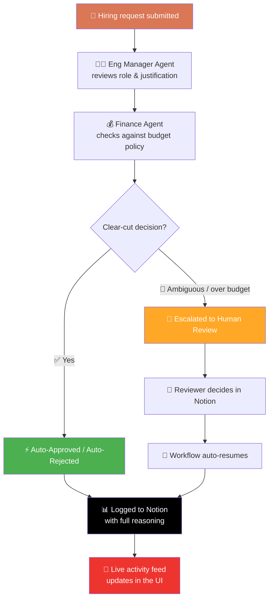

<div align="center">

# 🔁 HireLoop

### AI agents that vet hiring requests — with humans always in the loop.

*Two specialized AI agents evaluate every hiring request against real company policy. Clear-cut calls resolve automatically. Judgment calls escalate to a human — live, in Notion.*

[](https://convex.dev)
[](https://notion.so)
[](https://anthropic.com)
[](https://react.dev)

<br/>

`⭐ Star this repo` &nbsp;•&nbsp; `🍴 Fork it` &nbsp;•&nbsp; `🐛 Report a bug`

</div>

---

## 💡 What is this?

Hiring managers submit a request — role, level, salary, justification. HireLoop routes it through two AI agents:

| Agent | Job |
|---|---|
| 🧑‍💼 **Eng Manager Agent** | Reads the request, checks it makes sense against the role and team context |
| 💰 **Finance Agent** | Checks the ask against real, live company budget policy pulled from Notion |

If both agents agree it's a clean case → **auto-resolved in seconds.**
If it's ambiguous or over budget → **escalated to a human**, who reviews and decides right inside Notion — and the moment they do, HireLoop picks the workflow back up automatically.

No black box. Every decision — automatic or human — is logged with full reasoning, forever, in Notion.

---

## ✨ Why it's worth a look

- 🤖 **Multi-agent orchestration** — two purpose-built agents, not one agent doing everything
- 🔗 **Notion as the system of record** — no separate admin panel to build or maintain
- 🧑‍⚖️ **Human-in-the-loop by design** — automation for the obvious, judgment for the rest
- ⚡ **Real-time everywhere** — Convex pushes every state change straight to the UI
- 📜 **Fully auditable** — every auto-approval, auto-rejection, and human override is logged with reasoning
- 🔌 **Model-agnostic** — ships with Grok, swap in Claude, Gemini, or OpenAI in one file

---

## 🧭 How a request flows



---

## 🛠️ Tech Stack

<div align="center">

| Layer | Technology |
|:---:|:---:|
| **Agent reasoning** | Grok (swappable for Claude / Gemini / OpenAI) |
| **Backend & real-time sync** | Convex |
| **System of record** | Notion (databases + optional webhooks) |
| **Frontend** | React + Vite |
| **Human-in-the-loop bridge** | Notion webhook *or* Convex cron polling |

</div>

---

## 🚀 Quick Start

> Budget ~1–1.5 hours for a first-time full setup. Full step-by-step walkthrough is in [`SETUP.md`](./SETUP.md).

```bash
# 1. Install
cd hireloop
npm install

# 2. Spin up Convex (leave running — it live-reloads your backend)
npx convex dev

# 3. Wire up secrets
npx convex env set ANTHROPIC_API_KEY sk-ant-...
npx convex env set NOTION_TOKEN secret_...
npx convex env set NOTION_HIRING_DB_ID your-db-id
npx convex env set NOTION_POLICY_DB_ID your-db-id

# 4. Launch the frontend (second terminal)
npm run dev
```

Then submit a hiring request and watch the activity feed update live. 🎬

---

## 📁 Project Structure

```
convex/
├── schema.ts          # Database tables
├── hiringRequests.ts  # Mutations/queries, idempotent decision handler
├── policy.ts          # Policy cache
├── agents.ts          # Eng Manager + Finance agent logic, orchestration
├── notion.ts          # Notion read/write (policy sync, record sync)
├── http.ts            # Webhook route
└── lib/pacing.ts       # Rate-limit-safe pacing utility

src/
├── App.tsx             # Live demo frontend
└── main.tsx            # Convex provider setup
```

---

## 🎥 Demo Script

Two runs is all it takes to show the whole system off:

1. **The easy case** — a request comfortably within budget → watch it auto-resolve in real time.
2. **The judgment call** — a request that's over budget or ambiguous → watch it escalate, flip the status in Notion yourself, and watch HireLoop pick the workflow back up automatically.

---

<div align="center">

### Built with 🧠 multi-agent reasoning and a healthy respect for keeping humans in the loop.

</div>
